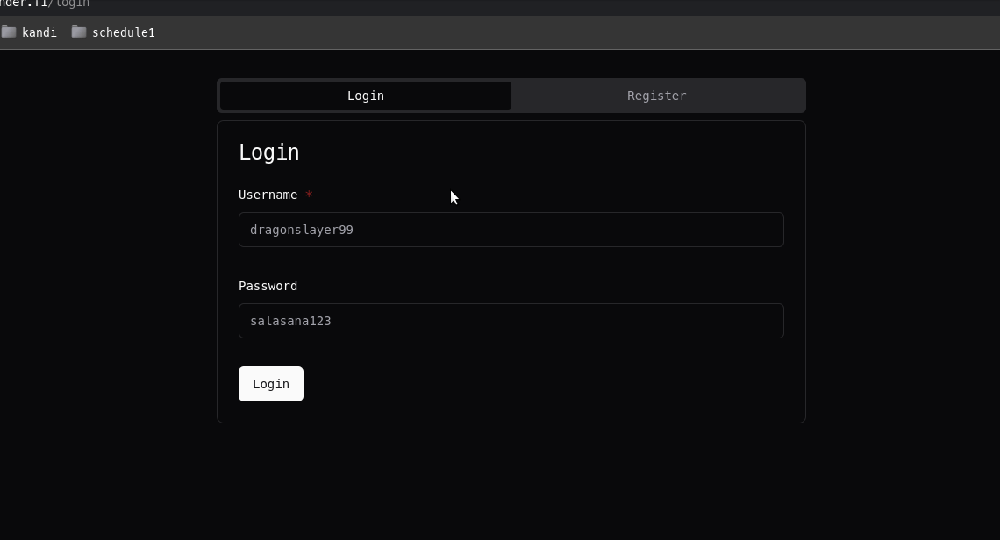
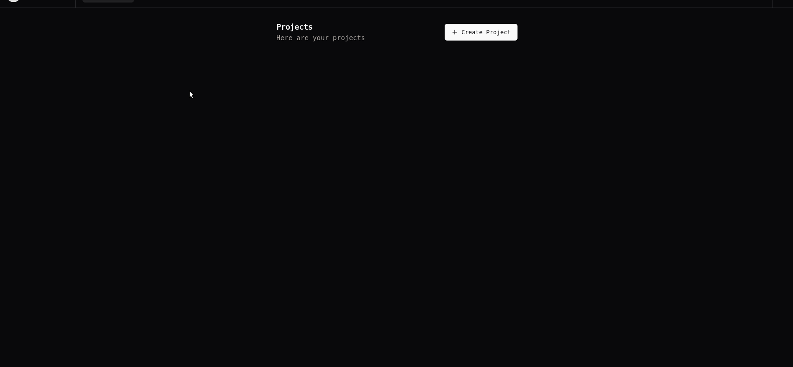
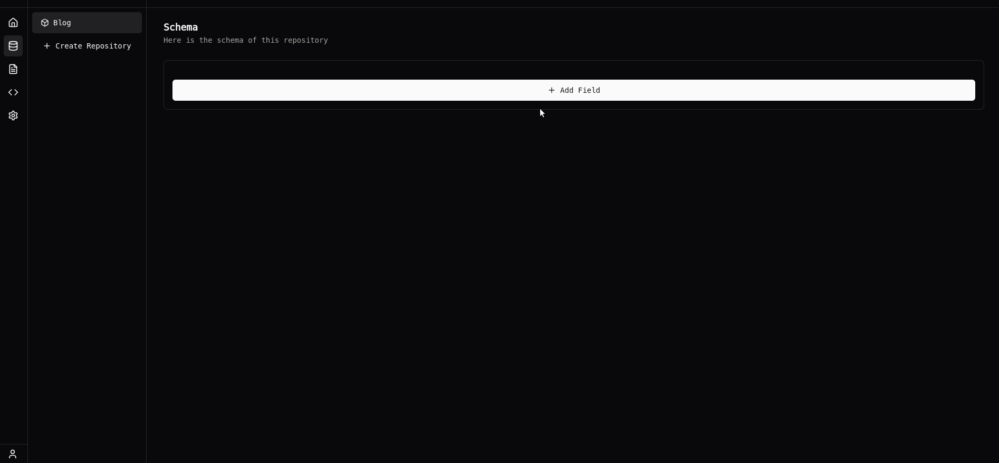
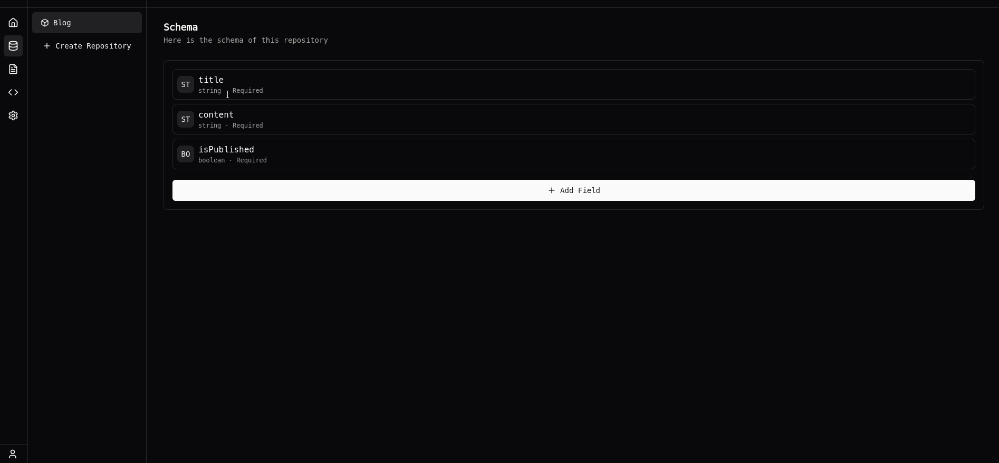
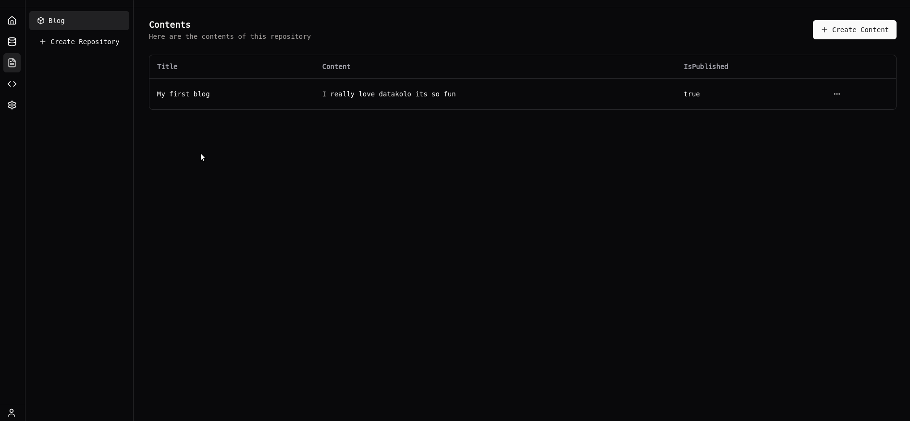
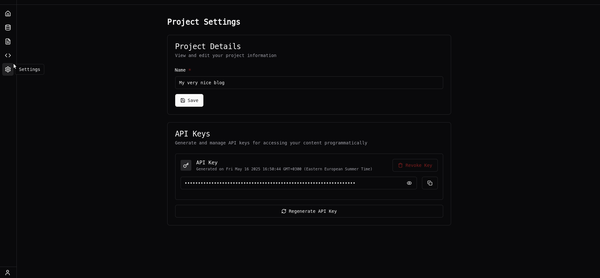

<p align="center">
    
</p>

<p align="center">
    <a href="https://codecov.io/gh/3nd3r1/datakolo" > 
         
    </a>
    <a href="https://github.com/3nd3r1/datakolo/actions/workflows/ci.yaml" > 
         
    </a>
</p>

<p align="center">
<strong>Datakolo</strong> is a headless CMS I built that lets you create content once and use it anywhere. No more copy-pasting between platforms or being stuck with trash templates. Just pure content freedom.
</p>

## Links

[Hour Reporting](./docs/hours.md)

## What is a Headless CMS? 🤔
It's like WordPress, but without all the bloated garbage.

Traditional CMS = content + presentation
Headless CMS = content only + API access

You create content once, then pull it into whatever frontend you want: websites, apps, AR/VR, whatever.

## The Stack 🛠️

**Frontend:**
- Next.js
- Tailwind CSS + shadcn/ui
- React Hook Form + Zod

**Backend:**
- Deno
- Oak (Express.js for Deno)
- MongoDB
- JWT

## How to Use This Thing 👀

### 1️⃣ Create an Account
Sign up, log in, the usual drill.



### 2️⃣ Make a Project
Projects are like folders for your content.



### 3️⃣ Define Your Content Structure
This is where it gets fun. Want a blog? Define what posts look like. Product catalog? Define what products look like.

```
Example Post Schema:
- title (string, required)
- content (string, required) 
- isPublished (boolean)
```




### 4️⃣ Create Some Content
Fill in the fields based on your schema. Datakolo validates everything so you can't mess it up.



### 5️⃣ Get Your API Key
Go to Settings, generate an API key. Keep this secret.



### 6️⃣ Use the API Builder
Head to the API Builder tab and create your API queries:

- Select which repository you want to work with
- Choose an operation (Get All or Get One)
- If you're getting a specific item, enter its ID
- Copy the generated URL and code snippets



### 7️⃣ Use Your Content Anywhere
Your content is now available through a clean API.

## API Quick Start 🔌

### Endpoints

#### Get All Items
```
GET /api/v1/projects/:projectId/repositories/:repositoryId/contents
```

#### Get One Item
```
GET /api/v1/projects/:projectId/repositories/:repositoryId/contents/:id
```

Always include your API key:
```
Authorization: Bearer YOUR_API_KEY_HERE
```

## Why This is Actually Useful 🧠

- Build your portfolio/blog/app exactly how you want it
- Future-proof your content when frontend tech inevitably changes again
- No more copy-pasting content between platforms
- Your content, your rules

## Local Dev Setup ⚙️

1. Clone this bad boy
2. `docker-compose up`
3. Backend on http://localhost:8000
4. Frontend on http://localhost:3000
5. Go crazy

## One More Thing...

Made with ❤️. Star it on GitHub if you're feeling generous.

That's it. Lock in and go build something awesome with it.
